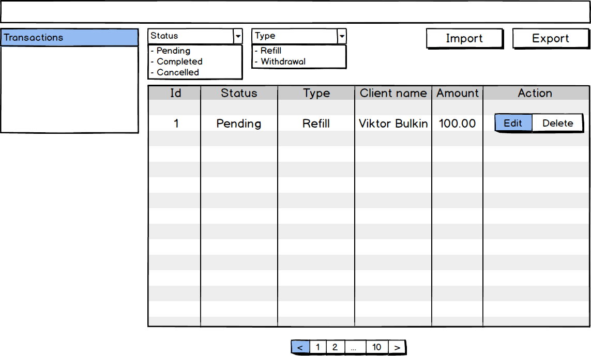
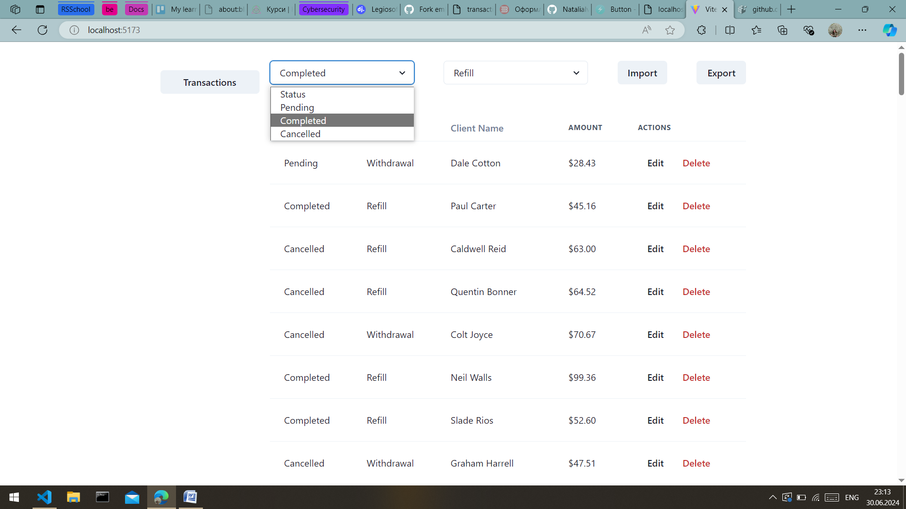

# React test case

- [Link to the task](https://github.com/emleonid/test-case-react/)

## Overview

This project is a React application built with Vite, designed for managing transactions.

It includes features for:

- importing transactions from CSV files,
- filtering transaction data,
- sorting transaction data,
- displaying transaction data,
- exporting filtered data back to CSV format.

## Prerequisites

Before starting, ensure you have Node.js and npm installed.

## Installation

### Clone the repository:

- git clone https://github.com/NataliaIv90/LegioSoft-vite-project.git
- cd LegioSoft-vite-project

### Install dependencies:

npm install

## Scripts

- dev: Runs Vite in development mode.
- build: Builds the TypeScript files and then runs Vite to build the application for production.
- lint: Lints TypeScript and TypeScript React files using ESLint.
- preview: Previews the production build of the application locally.
- start: Starts the server with the compiled TypeScript code.

## Usage

To start the development server:

- npm run dev
- Open http://localhost:5173 to view it in the browser.

To start the backend server:

- copy server.js from src/ folder to the dist/ folder
- npm start
- Open http://localhost:4000 to view it in the browser.

## Components

📗 Main. The Main component is the main entry point of the application, rendering the header, table, and pagination components. It manages state for filtering transactions based on status and type, current page, items per page, and data to export.

📗 MainHeader. The MainHeader component handles file upload for importing transactions, filtering by status and type, and exporting filtered data to CSV format.

📗 MainTable. The MainTable component displays transaction data in a table format. It fetches transactions from the server using react-query, allows sorting by columns, filtering by status and type, and supports deletion of transactions.

## Technologies Used

### Frontend:

- React
- Chakra UI for styling
- react-query for data fetching and state management
- TypeScript for type safety
- Vite for fast build and development
- papaparse for CSV parsing

### Backend:

- Express.js for server-side logic
- SQLite3 for database management

## Screenshots:

